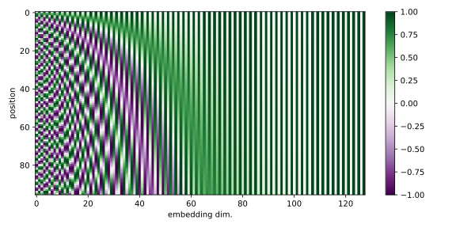

# Attention mechanism



A short introduction to attention in deep neural networks is provided.
The important components of the classical transformer architecture are discussed.
Following this, a vision transformer (ViT) is implemented and briefly tested.


## Notebooks

- [Introduction](notebooks/intro.ipynb)

- [(Fashion) MNIST example](notebooks/vit.ipynb)


## Installation

```
pip install -e .
```


## ViT training

```
python scripts/main.py fit --config config/vit_mnist.yaml
```

```
python scripts/main.py fit --config config/vit_fmnist.yaml
```

